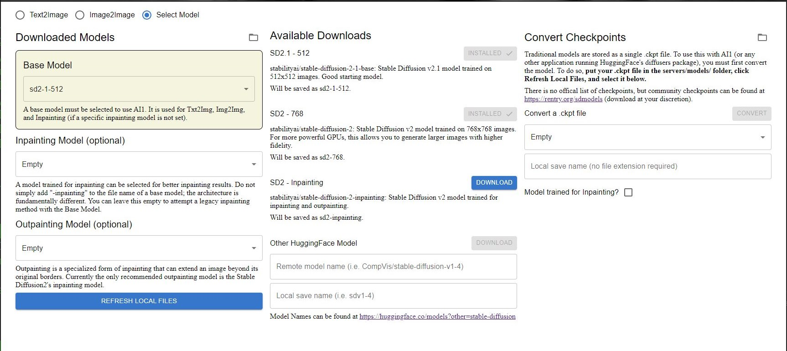
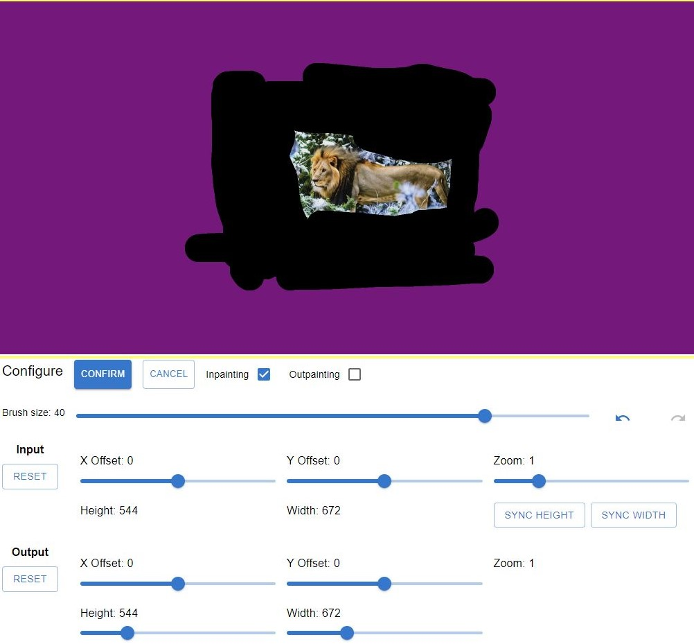
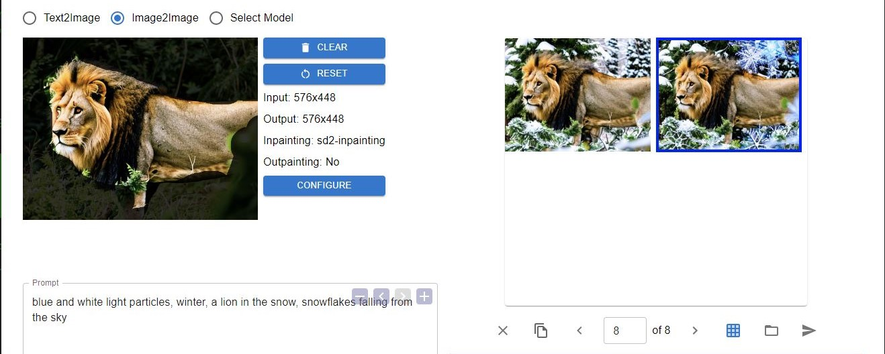
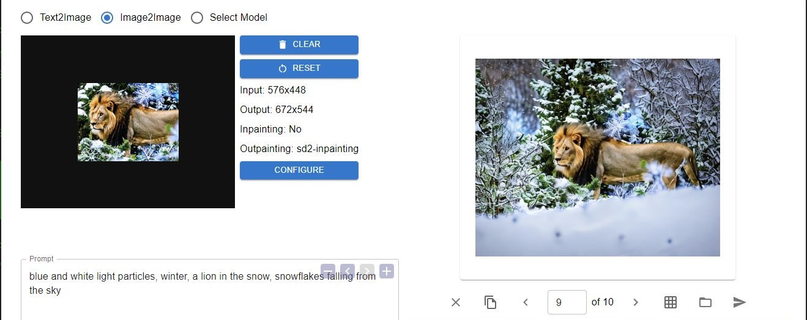

# all-is-one (beta)
AI1 is an all-inclusive user interface for AI image generation with procedural experiment capabilities. The user interface is intuitive to understand for beginners while also providing advanced features. Open source under the Apache 2.0 license.

Mac version is working in testing. Will be released soon!
- to update your environment, if it exists already: conda env update --name ai1 --file environment.yaml --prune

1. [Standard Features](#standard)
1. [Full Features](#features)
1. [Installation](#installation)


## Standard Features<a name="standard"></a>
- txt2img
- img2img
- img2video (new)
- inpainting, with mask editor
    - support for legacy inpainting without a fine-tuned model
    - support for fine-tuned SD 1.5/2.x inpainting models
- outpainting, with SD 2.x inpainting model
- editing tab with extra features:
    - Face restoration
    - Image Upscaling
- model manager
    - download models within the UI
    - convert .ckpt files within the UI

## Features<a name="features"></a>
- Procedural Submit allows you to send variations of any parameter/multiple parameters and see what all the generations would look like in a single batch


- In-house image browser lets you view past generations, as well as view/reuse the same parameters used, including the initial image (img2img), prompt, negative prompt, etc.

<p float="left">


</p>

- Model Manager lets you download diffusers models and convert .ckpt files straight from your UI


- Support for inpainting and outpainting



<p float="left">


</p>

- Undo Redo functionality
- Tips and Prompt Help buttons to assist new users


## Installation<a name="installation"></a>:
- ```cd all-is-one/server```
    - for now, server/ is the working folder (sorry)
- ```conda env create -n ai1 --file environment.yaml```
    - to update your environment, if it exists already: ```conda env update --name ai1 --file environment.yaml --prune```
- ```conda activate ai1```
- get token from https://huggingface.co/settings/tokens
- create .env file in the server/ folder with ```HF_TOKEN=[your_token]```
- ~~python setup.py~~ (no longer needed, go to Select Model in the UI to download/convert models)
- ```python server.py```
    - leave this running in the background
- go to http://localhost:5050/
    - Done!
    - The first run will take you to the "Select Model" tab, where you can download models from HuggingFace or convert .ckpt files


