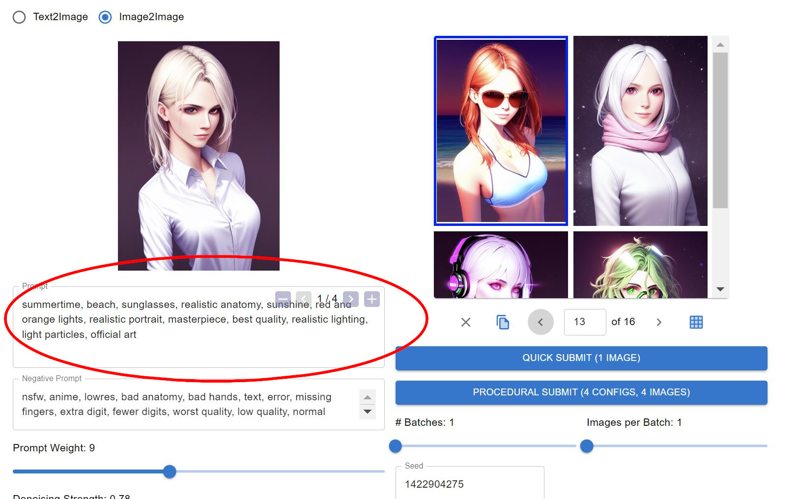
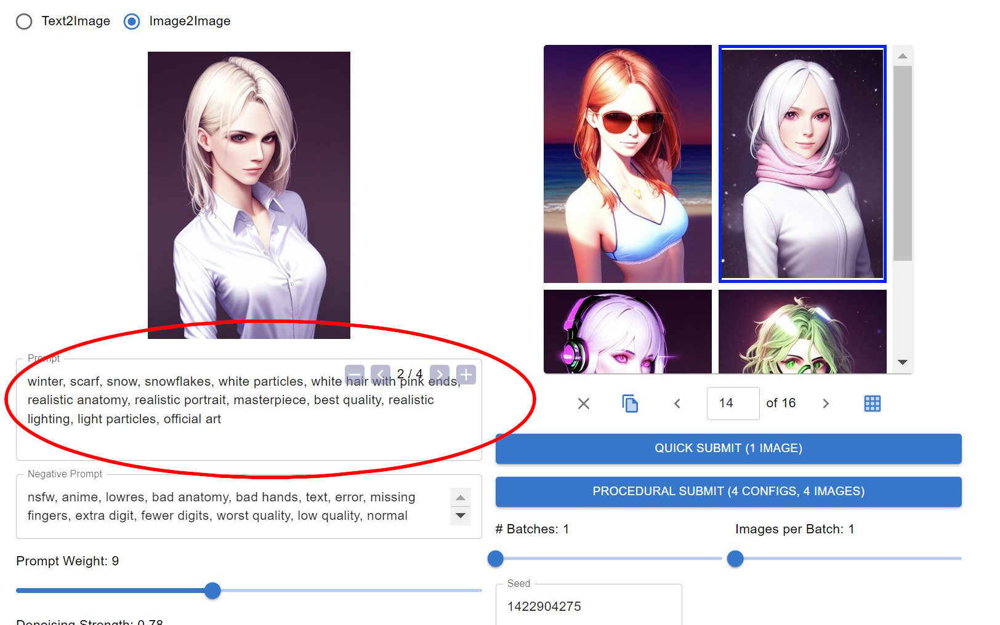
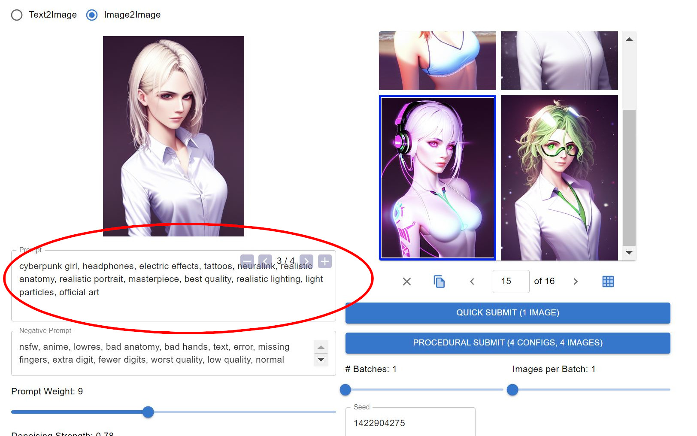
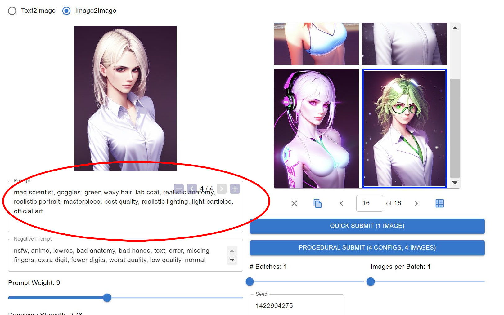

# all-is-one (alpha)
AI1 is an all-inclusive user interface for AI image generation with procedural experiment capabilities. A project that I am committed to in my spare time. Open source under the Apache 2.0 license.

## Standard Features
- txt2img
- img2img
- work in progress, will be adding standard features such as face restoration, inpainting, upscaling, as well as newer features such as eDiffi's segmentation maps

## Features
- Procedural Submit allows you to send variations of any parameter/multiple parameters and see what all the generations would look like in a single batch

- In-house image browser lets you view past generations, as well as view/reuse the same parameters used, including the initial image (img2img), prompt, negative prompt, etc.

- Undo Redo functionality
- Tips and Prompt Help buttons to assist new users

## Installation:
- cd all-is-one/server
    - for now, /server is the working folder (sorry)
- conda env create -n ai1 --file environment.yaml
- conda activate ai1
- get token from https://huggingface.co/settings/tokens
- create .env file with "HF_TOKEN=[your_token]"
- python setup.py
    - this downloads the base model from huggingface. if you have your own .ckpt, you can convert that to the huggingface compatible model with
    - python scripts/sd_to_diffusers.py --checkpoint_path [path to your model, i.e. models/model.ckpt] --original_config_file models/v1-inference.yaml --scheduler_type ddim --dump_path cache/[converted_model_name]
    - then in opts.py, change "model_cache_path='cache/sd'" to "model_cache_path='cache/[converted_model_name]',"
    - https://rentry.org/sdmodels has some better models to start with. Download one then convert it.
- python server.py
    - leave this running in the background
- go to http://localhost:5050/
    - Done!
